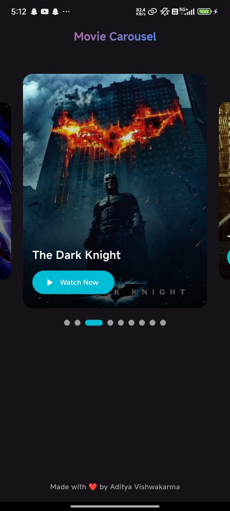

# 🎬 Movie Carousel App

A beautiful Flutter app that displays a carousel of popular movies with shimmer loading effects and "Watch Now" buttons that link directly to IMDb pages. The app supports light and dark themes and auto-adjusts based on the system setting.

---

## 🚀 Features

- Movie image carousel with title and CTA button.
- Smooth page indicator for active slide tracking.
- Shimmer loading effect for better UX.
- Opens IMDb links via "Watch Now".
- Adaptive Light & Dark theme based on system mode.

---

## 📦 Packages Used

| Package                 | Purpose                               |
| ----------------------- | ------------------------------------- |
| `carousel_slider`       | Horizontal movie carousel             |
| `smooth_page_indicator` | Dots indicator for carousel           |
| `shimmer`               | Skeleton loading effect               |
| `url_launcher`          | Launch IMDb links in external browser |

---

## 🎨 Theme

The app uses **Material 3** with dynamic color support:

- Light Theme & Dark Theme handled using `ThemeMode.system`
- Custom gradient AppBar title
- Consistent color scheme using `ColorScheme.fromSeed`

---

## 📱 Screenshot

| Home Screen                                   |
| --------------------------------------------- |
|  |

---

## 👨‍💻 Developer

**Made with ❤️ by Aditya Vishwakarma**

---

## 🔗 License

This project is open-source and available for learning and improvement.
